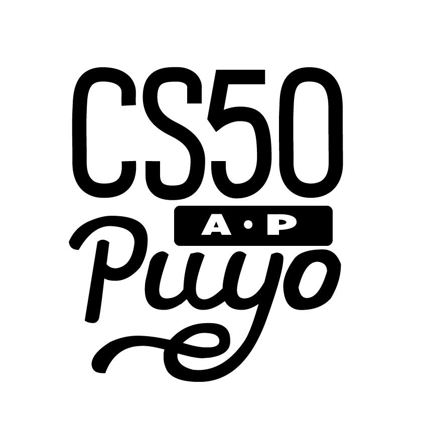

# CS50 Puyo Blog

This blog has been created in order to report the project CS50 Puyo.
CS50 Puyo is a programming course based on
[CS50x][1],
[CS50 AP][2],
and [MITx 6.00.1x][3].

This blog uses [Clean Blog](http://startbootstrap.com/template-overviews/clean-blog/) as a base template.

[1]: https://www.edx.org/course/introduction-computer-science-harvardx-cs50x
[2]: https://www.edx.org/course/apr-computer-science-principles-harvardx-cs50-ap
[3]: https://www.edx.org/course/introduction-computer-science-mitx-6-00-1x-11
